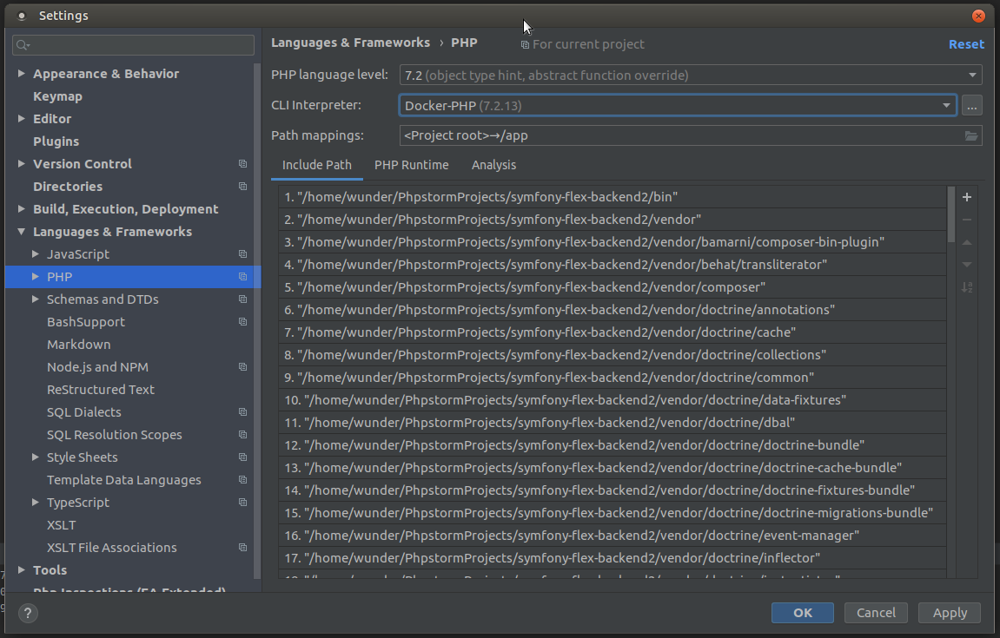
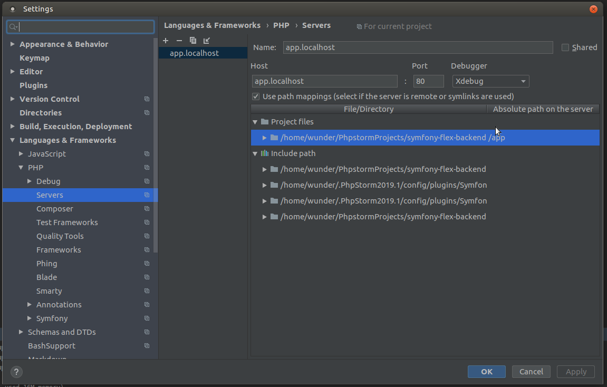
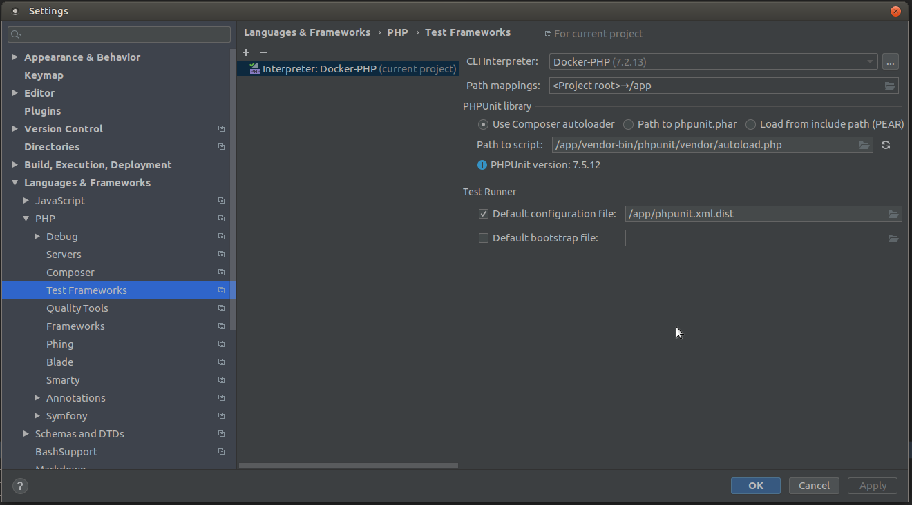
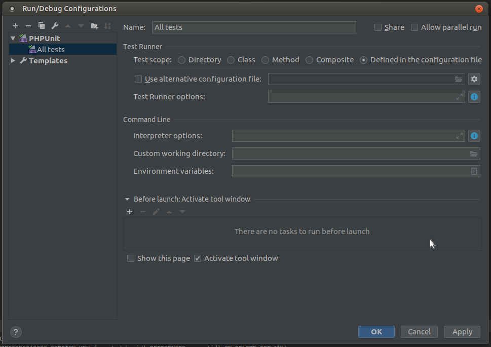

# What is this?

This document contains information how you can setup your [PhpStorm](https://www.jetbrains.com/phpstorm/)
for this application _"correct"_ way.

For recommend plugins see [External links / resources](#external-links--resources)
section of this documentation.

## Table of Contents

* [What is this?](#what-is-this)
  * [Table of Contents](#table-of-contents)
  * [Setup](#setup)
    * [CLI Interpreter](#cli-interpreter)
    * [Server](#server)
    * [Test Frameworks](#test-frameworks)
    * [Debugging](#debugging)
  * [External links / resources](#external-links--resources)

## Setup

### CLI Interpreter

First thing that you need to do is select correct CLI interpreter for your
PhpStorm. Selection should be available on `Settings -> Languages & Frameworks
-> PHP`
section.

Just choose the `Docker-PHP` from dropdown, if that does not exist there you
need to click that `...` and follow the instructions found in [External links / resources](#external-links--resources)
section - Configuring Remote PHP Interpreters.

### Server

Next thing to configure is used PHP servers. This you can do in
`Settings -> Languages & Frameworks -> PHP -> Servers` - purpose of this is to
configure your PhpStorm to know how your local files are mapped inside that
docker container.

### Test Frameworks

Application itself contains quite lot of tests as you know from that [testing](TESTING.md)
documentation. To get support to run tests directly from your IDE you need to
do following configuration in `Settings -> Languages & Frameworks -> PHP ->
Test Frameworks`.

By default settings should be set correctly but just ensure that  those are set
as in image below.

After this you need to add Run/Debug configuration for PHPUnit. In that prompt
you should see the same as image below.

Note that if you see `Fix` button on bottom right corner just click that to fix
all settings as those should be. Basically that will make PHPUnit to use all
those earlier configured settings.

### Debugging

Application supports using of XDebug for debugging tool, so just read [Using Xdebug](XDEBUG.md)
documentation and you're ready to start debugging your application.

## External links / resources

* [Configuring Remote PHP Interpreters](https://www.jetbrains.com/help/phpstorm/configuring-remote-interpreters.html)
* [Test Frameworks](https://www.jetbrains.com/help/phpstorm/php-test-frameworks.html)
* [Symfony Development using PhpStorm](http://blog.jetbrains.com/phpstorm/2014/08/symfony-development-using-phpstorm/)
* [Symfony Plugin plugin for PhpStorm](https://plugins.jetbrains.com/plugin/7219-symfony-plugin)
* [PHP Annotations plugin for PhpStorm](https://plugins.jetbrains.com/plugin/7320)
* [Php Inspections (EA Extended) plugin for PhpStorm](https://plugins.jetbrains.com/idea/plugin/7622-php-inspections-ea-extended-)
* [EditorConfig](https://plugins.jetbrains.com/plugin/7294-editorconfig)
